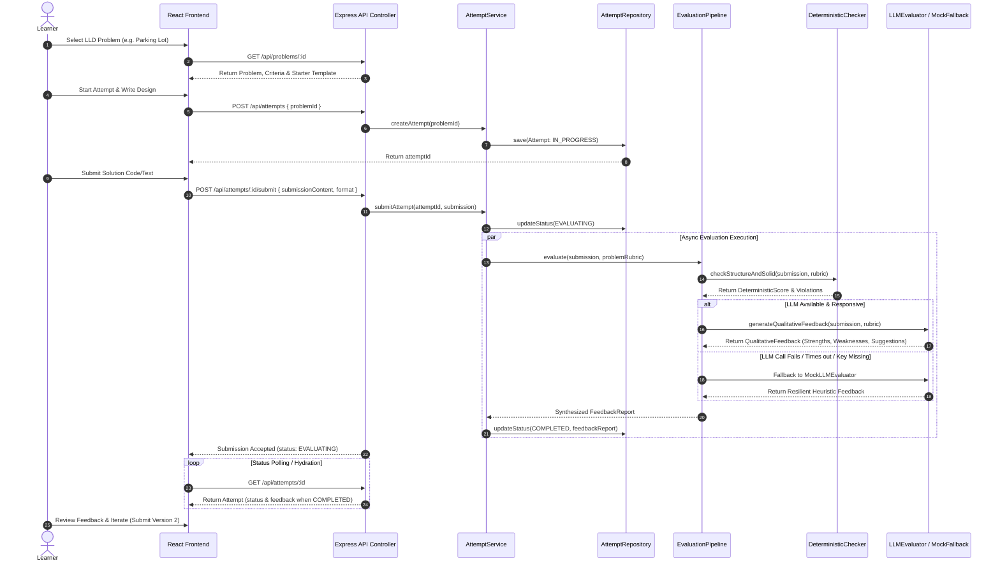

# Design Note: LLD Practice Platform MVP Architecture

- **Author:** Amitesh Kumar Dubey
- **Date:** 23 September 2026
- **Status:** MVP Prototype — Assignment Submission

---

## 1. MVP Executive Summary

The **LLD Practice Platform** MVP is designed as an extensible, domain-focused monolith that enables software engineers to practice Low-Level System Design interactively. 

Rather than focusing on heavy cloud infrastructure (Kubernetes, microservices, distributed message queues), this system concentrates 100% of its engineering complexity on **Object-Oriented Design (OOD)**, clean domain abstractions, deterministic AST-based code analysis, and resilient LLM qualitative feedback orchestration.

### Core Value Proposition & Learner Journey
1. **Choose Problem:** Select from a curated problem set (Parking Lot, Elevator Control System, Vending Machine, Rate Limiter).
2. **Think / Design:** Solicit template starter code/text and draft solutions in Code (TypeScript, Java, Python), Structured Text, or PlantUML.
3. **Submit Solution:** Post the solution and transition the attempt state to `EVALUATING`.
4. **Get Hybrid Feedback:** Receive instant deterministic score breakdown (class structure, encapsulation, SOLID anti-patterns) plus qualitative reasoning (trade-off analysis, edge cases, suggested refactorings).
5. **Review & Iterate:** Compare scores against past attempts in attempt history, refine the design, and resubmit.

---

## 2. End-to-End Practice & Evaluation Flow (Mermaid Diagram)



---

## 3. Key Classes & Interfaces (Domain Layer Design)

The core domain is structured following clean architecture principles. Domain entities have explicit encapsulation and domain logic, isolated from persistence and UI concerns.

```
                  +-------------------+
                  |  IEvaluator (I)   |
                  +-------------------+
                            ^
                            |
           +----------------+----------------+
           |                                 |
+----------------------+         +-----------------------+
| DeterministicChecker |         |     LLMEvaluator      |
+----------------------+         +-----------------------+
                                             | (fallback)
                                 +-----------------------+
                                 |   MockLLMEvaluator    |
                                 +-----------------------+
```

### Class Responsibilities & Abstractions

| Component / Class Name | Type | Responsibility & Design Rationale |
| :--- | :--- | :--- |
| `Problem` | Domain Entity | Encapsulates problem statement, difficulty, tags, requirements list, design rubrics, and starter code templates. Immutable domain root. |
| `Submission` | Value Object | Represents a learner's submission snapshot. Holds `attemptId`, `version`, `format` (JAVA, TS, PYTHON, TEXT, PLANTUML), and raw design `content`. |
| `Attempt` | Aggregate Root | Manages attempt state lifecycle (`IN_PROGRESS`, `SUBMITTED`, `EVALUATING`, `COMPLETED`, `EVALUATION_FAILED`). Maintains an array of historical `Submission` snapshots and final `FeedbackReport`. Enforces state transition rules. |
| `FeedbackReport` | Value Object | Holds synthesized evaluation output: overall score (0–100), deterministic score, qualitative score, SOLID violations list, missing required classes/methods, strengths, and actionable improvement recommendations. |
| `IEvaluator` | Interface | Strategy interface for submission evaluation. Decouples the evaluation logic from specific checking strategies (`evaluate(submission: Submission, rubric: ProblemRubric): Promise<PartialFeedbackReport>`). |
| `DeterministicChecker` | Class (Implements `IEvaluator`) | Performs static code & text structure analysis. Uses regular expressions / AST parsers to inspect class definitions, interface declarations, enum usage, missing domain methods, naming conventions, and common SOLID anti-patterns (e.g., God Class, missing interfaces). |
| `LLMEvaluator` | Class (Implements `IEvaluator`) | Connects to OpenAI/Claude LLM APIs using a structured JSON prompt schema to evaluate high-level design quality, design pattern appropriateness, trade-offs, and edge-case handling. |
| `MockLLMEvaluator` | Class (Implements `IEvaluator`) | Fallback evaluator providing deterministic heuristic design critiques when LLM API keys are unconfigured, rate-limited, or timing out. Guarantees 100% platform availability. |
| `EvaluationPipeline` | Domain Orchestrator | Executes `IEvaluator` implementations in parallel or sequence, handles timeouts (e.g., 8-second limit), handles exceptions gracefully, and merges partial feedback into a unified `FeedbackReport`. |
| `IAttemptRepository` | Interface | Data access abstraction for managing `Attempt` lifecycle persistence. Decouples domain services from database implementation. |
| `SQLiteAttemptRepository` | Class (Implements `IAttemptRepository`) | SQLite / in-memory database adapter for persistent storage without requiring external DB containers. |

---

## 4. Evaluation Approach & Strategy

Evaluation operates on a **hybrid strategy**:

1. **Deterministic Layer (Weight: 40%)**
   - **Structure Check:** Checks whether expected classes (e.g. `ParkingLot`, `ParkingSpot`, `Vehicle`, `Ticket`) and interfaces/enums (`VehicleType`, `IPricingStrategy`) are present.
   - **Encapsulation & Method Check:** Verifies presence of public APIs and proper member access control.
   - **SOLID Anti-Pattern Detection:** Detects god classes (classes exceeding threshold complexity), hardcoded dependencies instead of dependency injection, and missing interfaces for strategy patterns.

2. **Qualitative Reasoning Layer (Weight: 60%)**
   - **Design Pattern Correctness:** Evaluates whether appropriate patterns (Strategy, State, Observer, Factory) were selected and properly implemented.
   - **Trade-Off & Edge Case Analysis:** Evaluates how well the design handles concurrency, scalability boundaries, thread-safety, and invalid input states.
   - **Actionable Guidance:** Generates specific line-by-line refactoring recommendations.

---

## 5. Architectural Trade-offs & Engineering Decisions

| Decision Area | Chosen Approach | Alternative Considered | Rationale for Choice |
| :--- | :--- | :--- | :--- |
| **System Architecture** | Simple Monolith (Express + Node + SQLite) | Microservices + Message Queues (RabbitMQ/Kafka) | Assignment spec strictly emphasizes LLD domain design over HLD infrastructure complexity. A monolith keeps deployment zero-config while providing instant local evaluation. |
| **State Synchronization** | Async State + Client Polling | WebSockets / Server-Sent Events (SSE) | Polling `GET /api/attempts/:id` every 2s during evaluation is robust, stateless, trivial to recover from server restarts, and handles network disconnections gracefully. |
| **LLM Resilience** | Strategy Pattern with `MockLLMEvaluator` Fallback | Blocking Sync API Call / Failing on Error | External LLM APIs can fail or require paid API keys. The mock fallback ensures the platform functions flawlessly out of the box for any evaluator testing the app. |
| **Data Persistence** | SQLite / Abstracted Repository Pattern | In-memory only / Heavy PostgreSQL DB | SQLite provides true SQL persistence across app restarts with zero background daemon overhead. Abstracting it behind `IAttemptRepository` allows swapping to Postgres in 10 lines of code. |
